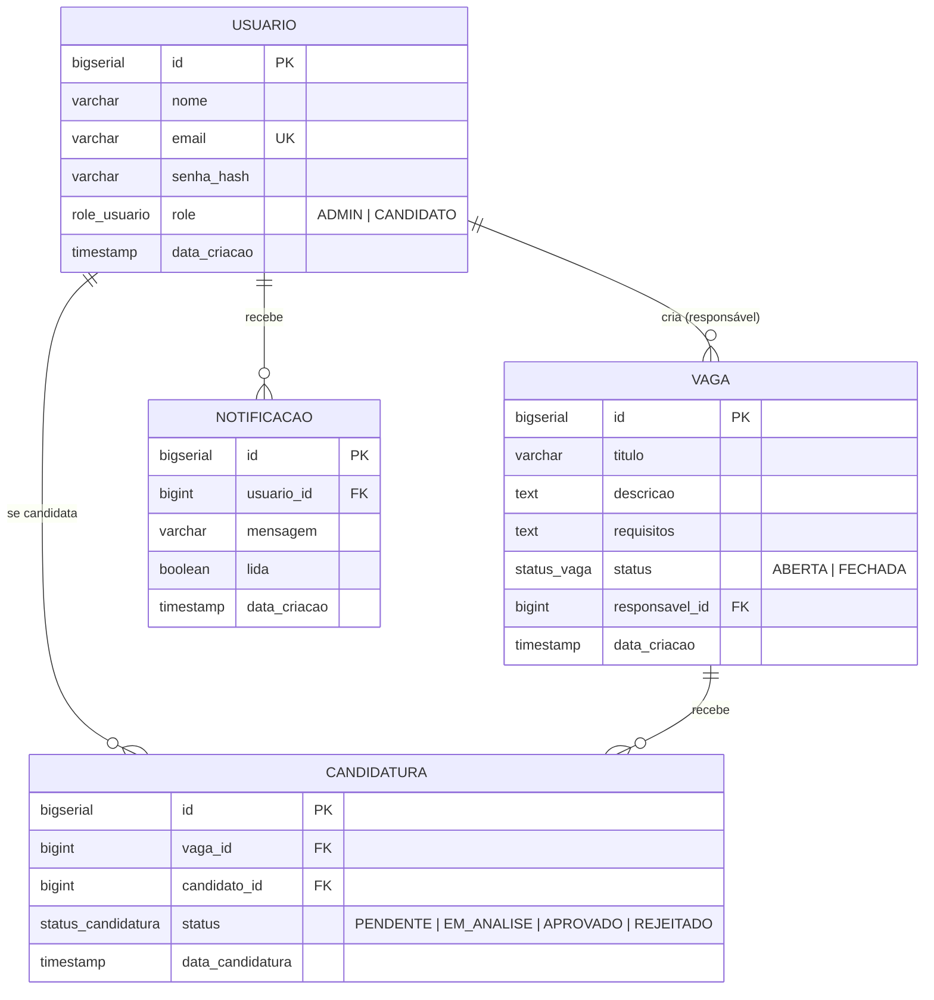

# Recrutamento Interno

Aplicação web para recrutamento interno, desenvolvida como desafio técnico para vaga de Desenvolvedor Full Stack (Java + Angular) — Nível Pleno.

Permite que colaboradores pesquisem vagas internas e se candidatem, e que administradores cadastrem e gerenciem vagas, acompanhando as candidaturas recebidas.

---

## 🔗 Demonstração ao Vivo

A aplicação está implantada em uma instância AWS EC2, com HTTPS via Let's Encrypt:

- **Aplicação:** https://recrutamento-pacto.duckdns.org
- **Swagger:** https://recrutamento-pacto.duckdns.org/api/swagger-ui.html

> Se o domínio não carregar (algumas redes corporativas bloqueiam subdomínios `.duckdns.org`), use o acesso direto por IP: **http://18.118.211.249**

**Credenciais de teste:** ver seção [Credenciais de Teste](#credenciais-de-teste) abaixo.

---

## Stack Técnica

| Camada | Tecnologia |
|---|---|
| Backend | Java 8, Spring Boot 2.7.18, Spring Security, Spring Data JPA |
| Autenticação | JWT (JSON Web Token) |
| Banco de dados | PostgreSQL 15 |
| Migrations | Flyway |
| Documentação da API | springdoc-openapi (Swagger UI) |
| Frontend | Angular 22, Angular Material |
| Containerização | Docker + Docker Compose |
| Testes | JUnit 5 + Mockito |

> **Nota sobre versões:** o desafio especifica Java 8+ e Spring Boot 2.0+ como requisitos mínimos. Optei por Java 8 e Spring Boot 2.7.18 (últimas versões estáveis dentro dessas séries) no backend, e pela versão mais recente do Angular (22) no frontend, já que o documento não especifica uma versão máxima.

---

## Funcionalidades Implementadas

- ✅ Autenticação e autorização (JWT, senhas com hash BCrypt)
- ✅ Registro público (sempre cria usuário `CANDIDATO`)
- ✅ Cadastro de vagas — criar, editar, excluir (somente `ADMIN`)
- ✅ Candidatura a vagas, com notificação ao responsável pela vaga e ao candidato
- ✅ Painel do candidato (acompanhamento de status das candidaturas)
- ✅ Responsivo (mobile/tablet/desktop)
- ✅ Documentação interativa da API (Swagger)
- ✅ Testes automatizados dos principais services
- ✅ Empacotamento via Docker Compose

**Não implementado** (bônus fora do escopo priorizado, dado o prazo do desafio):
- Avaliação de candidatos com filtros por requisitos/tempo de empresa

---

## Como Rodar o Projeto

Existem duas formas de rodar a aplicação: **via Docker** (recomendado, mais simples) ou **localmente** (backend e frontend separados).

### Opção A — Via Docker Compose (recomendado)

**Pré-requisitos:** Docker e Docker Compose instalados.

Na raiz do projeto:

```bash
docker-compose up --build
```

Aguarde os três serviços subirem (primeira execução demora mais, baixa as imagens). Acesse:

- **Frontend:** http://localhost:8081
- **Backend/API:** http://localhost:8080
- **Swagger:** http://localhost:8080/swagger-ui.html

Para parar:

```bash
docker-compose down
```

Para parar e apagar também os dados do banco:

```bash
docker-compose down -v
```

### Opção B — Rodando localmente (backend e frontend separados)

**Pré-requisitos:**
- JDK 8+
- Maven (ou use o wrapper `./mvnw` incluído)
- Node.js 22+ e Angular CLI (`npm install -g @angular/cli`)
- PostgreSQL 15 rodando localmente (ou via `docker run`)

**1. Suba o PostgreSQL:**

```bash
docker run --name pg-recrutamento -e POSTGRES_PASSWORD=postgres -e POSTGRES_DB=recrutamento_interno -p 5432:5432 -d postgres:15
```

**2. Backend:**

```bash
cd backend
./mvnw spring-boot:run
```

A API sobe em `http://localhost:8080`. As migrations do Flyway rodam automaticamente na inicialização (criam as tabelas e um usuário admin inicial).

**3. Frontend** (em outro terminal):

```bash
cd frontend
npm install
ng serve
```

Acesse `http://localhost:4200`.

---

## Credenciais de Teste

Um usuário administrador é criado automaticamente via migration na primeira inicialização:

| Perfil | E-mail | Senha |
|---|---|---|
| Administrador | `admin@pacto.com` | `admin123` |

Para testar como candidato, use a tela de **Cadastro** (`/registro`) — todo registro público cria automaticamente um usuário com perfil `CANDIDATO`. Não é possível criar um novo `ADMIN` pela interface, por design (ver seção de decisões técnicas).

---

## Estrutura do Projeto

```
recrutamento-interno/
├── backend/                 # API REST (Spring Boot)
│   └── src/main/java/com/pacto/recrutamento/
│       ├── config/           # Configurações (Security, CORS)
│       ├── controller/       # Endpoints REST
│       ├── service/          # Regras de negócio
│       ├── repository/       # Spring Data JPA
│       ├── model/            # Entidades JPA + enums
│       ├── dto/               # Request/Response DTOs
│       ├── security/          # JWT (geração, validação, filtro)
│       └── exception/         # Tratamento global de erros
├── frontend/                # Aplicação Angular
│   └── src/app/
│       ├── core/              # Services, guards, interceptor, layout
│       ├── auth/              # Login e registro
│       ├── vagas/             # Listagem e CRUD de vagas
│       └── candidaturas/      # Painel do candidato
└── docker-compose.yml
```

---

## Modelo do Banco de Dados (ER)



---

## Endpoints Principais da API

Documentação completa e interativa disponível no Swagger (`/swagger-ui.html`) assim que o backend estiver rodando. Resumo:

| Método | Rota | Acesso |
|---|---|---|
| `POST` | `/auth/register` | Público |
| `POST` | `/auth/login` | Público |
| `GET` | `/vagas` | Autenticado |
| `POST` | `/vagas` | `ADMIN` |
| `PUT` | `/vagas/{id}` | `ADMIN` |
| `DELETE` | `/vagas/{id}` | `ADMIN` |
| `POST` | `/vagas/{id}/candidaturas` | `CANDIDATO` |
| `GET` | `/vagas/{id}/candidaturas` | `ADMIN` |
| `GET` | `/candidaturas/minhas` | Autenticado |

---

## Rodando os Testes

```bash
cd backend
./mvnw test
```

Cobertura atual: testes unitários dos services principais (`AuthService`, `VagaService`, `CandidaturaService`), validando as regras de negócio centrais — criação de vaga sempre `ABERTA`, prevenção de candidatura duplicada, registro público sempre como `CANDIDATO`, entre outras.

---

## Decisões Técnicas

- **Usuários ADMIN não são criados via registro público.** O cadastro público (`/auth/register`) sempre cria `CANDIDATO`; o único `ADMIN` do sistema é provisionado via migration Flyway (`V2__seed_admin.sql`). Essa decisão evita que qualquer pessoa se autopromova a administrador pela interface.
- **`responsavel_id` da vaga é atribuído automaticamente** ao admin que a cria — o documento não define um papel de "responsável" separado de "administrador", então tratamos como a mesma entidade.
- **ENUMs nativos do PostgreSQL** (`role_usuario`, `status_vaga`, `status_candidatura`) em vez de `VARCHAR`, para validação de valores no nível do banco.
- **Regra de candidatura duplicada** é garantida em duas camadas: constraint `UNIQUE` no banco (defesa final) e validação no service (mensagem de erro amigável).
- **CORS configurado explicitamente** para aceitar as origens do frontend (`localhost:4200` em desenvolvimento, `localhost` via Docker/Nginx).

---

## Diferenciais Implementados

- [x] Interface responsiva (mobile, tablet, desktop)
- [x] Docker Compose (backend + frontend + banco)
- [x] Boas práticas de UX (feedback visual de carregamento, mensagens de erro claras, confirmação antes de exclusão)
- [x] Documentação de API via Swagger
- [x] Testes automatizados
- [x] **Deploy em produção real** (AWS EC2 + HTTPS via Let's Encrypt) — além do escopo pedido pelo desafio

---

## Arquitetura de Deploy (extra, além do escopo)

Como iniciativa própria, a aplicação foi implantada em uma instância AWS EC2 (Ubuntu 24.04), com a seguinte arquitetura:

```
Navegador
   │
   ├── HTTPS (443) ──► Nginx (host) ──► /api/*  ──► Backend  (Docker, porta 8080)
   │                                └─► /*      ──► Frontend (Docker, porta 8081)
   │
   └── HTTP (80, acesso por IP) ──► mesmo proxy, sem redirect obrigatório
```

- **Nginx no host** (fora dos containers) atua como proxy reverso, unificando frontend e backend sob a mesma origem — evita problemas de CORS e "mixed content" em produção
- **Certificado TLS via Let's Encrypt/Certbot**, renovação automática
- **Domínio gratuito** via DuckDNS, apontando para o IP público da instância
- Acesso também disponível por IP puro (fallback), já que alguns provedores/redes corporativas bloqueiam subdomínios de DNS dinâmico